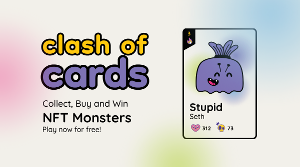

<h1 align="center">Clash of Cards</h1>

</img>

<b>
Clash of Cards is a web3 game based on Monster cards as NFTs.
</b>

    <a href="https://clashof.cards/"><b>Play Now</b> (only on Polygon Testnet)</a> •
    <a href="https://showcase.ethglobal.com/buildquest/orange-game-xeyr3"><b>Buildquest submission</b></a>

## Live demo

You can play game [here](https://clashof.cards/). Ensure that you have metamask or sequence wallet and ensure that it is pointing to the Polygon Mumbai testnet.

## Code organization

- [Web App](https://github.com/NaikAayush/clash-of-cards/tree/main/webapp): built using Angular - game UI, web3 integration, etc.
- [Smart Contracts](https://github.com/NaikAayush/clash-of-cards/tree/kontrakt/smart-contracts): smart contracts written in Solidity for match matching and game logic. Integrates Chainlink keepers for calling match-making code periodically.
- [NFT Generator](https://github.com/NaikAayush/clash-of-cards/tree/main/nft-art-generator): scripts to generate NFTs using assets and upload them to IPFS through Pinata.
